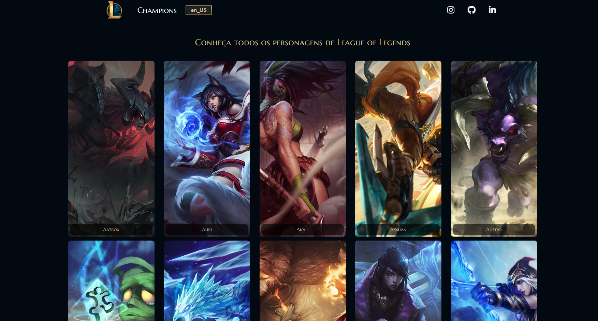

# League of Legends Champions

Este projeto é uma aplicação web que exibe uma lista de campeões do jogo League of Legends. Você pode ver informações e algumas características sobre cada campeão.

## Como funciona

A aplicação utiliza a API de dados do League of Legends (Data Dragon) para obter as informações dos campeões. O endpoint utilizado é `http://ddragon.leagueoflegends.com/cdn/12.6.1/data/{currentLanguage}/champion.json`, onde `{currentLanguage}` representa o idioma dos dados (por padrão, está configurado para `en_US`).

## Recursos

- Exibição de campeões: A aplicação exibe uma lista paginada de campeões, com cards contendo o nome e uma imagem de cada um.

- Detalhes do campeão: Ao clicar em um campeão, um modal é exibido com informações adicionais, incluindo uma imagem ampliada, nome, título e tags.

- Paginação: A lista de campeões é dividida em páginas para facilitar a navegação. Os botões "Próximo" e "Anterior" permitem percorrer as páginas.

- Alternar idioma: O botão "pt_BR/en_US" permite alternar entre os idiomas `en_US` e `pt_BR`, atualizando a exibição dos campeões de acordo com o idioma selecionado.

## Como usar

1. Clone o repositório para o seu ambiente local.

2. Abra o arquivo `index.html` em um navegador web.

3. A lista de campeões será exibida. Clique em um campeão para ver mais detalhes no modal.

4. Use os botões "Próximo" e "Anterior" para navegar entre as páginas da lista.

5. Clique no botão "Português/English" para alternar entre os idiomas.

## Contribuição

Contribuições são bem-vindas! Se você quiser adicionar mais recursos, aprimorar o design ou corrigir algum problema, fique à vontade para fazer um fork do repositório e enviar um pull request com as suas alterações.

## Licença

Este projeto está licenciado sob a licença [MIT](LICENSE).

